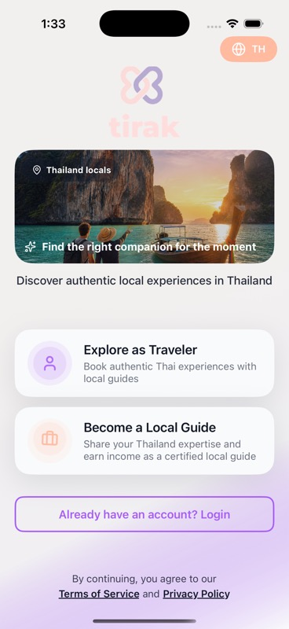
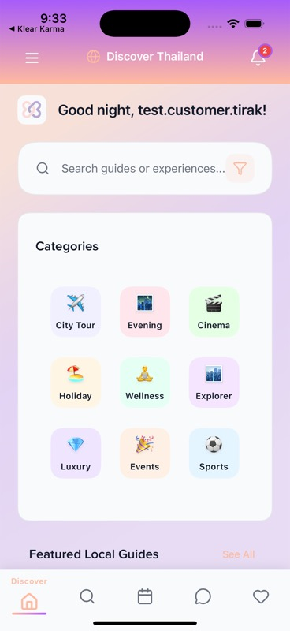
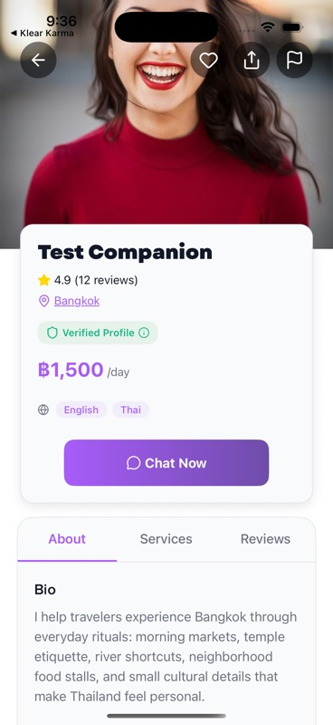

  
   
   
  
  <h1>Tirak</h1>
  
<strong>Thailand, guided by people who know it by heart.</strong>

  

    Tirak connects travellers with trusted local guides across Thailand for cultural experiences that feel personal, safe, and grounded in real local knowledge.
  

  

    
    
    
    
  

---

## About Us

Tirak was created for travellers who want more than a list of places to visit.

We believe the best travel memories come from context: why a temple matters, which stall has been serving the same family recipe for decades, when a market really comes alive, and what a visitor should know before entering a local space.

Tirak brings that context into one simple app. Travellers can discover local guides, explore experiences, book time, message before meeting, and keep their trip details in one place. Local guides can share their expertise, manage availability, present services, and receive booking requests through a focused guide dashboard.

The name Tirak comes from Thai usage of "beloved" or "dear". For us, it points to the kind of travel we want to support: thoughtful, respectful, human, and memorable.

## Product Preview

<table>
  <tr>
    <td align="center"><strong>Start with intent</strong></td>
    <td align="center"><strong>Discover local context</strong></td>
    <td align="center"><strong>Book with confidence</strong></td>
  </tr>
  <tr>
    <td></td>
    <td></td>
    <td></td>
  </tr>
</table>

## Description

Tirak is a travel marketplace for authentic local experiences in Thailand.

Travellers can:

- Browse trusted local guide profiles.
- Discover food tours, temple walks, market visits, cultural routes, and city experiences.
- Request guide rates and choose available dates.
- Confirm bookings and keep trip details accessible.
- Chat with their guide before and after booking.
- Save favourite guides for later.

Local guides can:

- Build a guide profile with bio, languages, photos, and services.
- Set availability and manage experience listings.
- Receive booking requests from travellers.
- Approve or decline requests.
- Chat with travellers in one place.
- Track bookings and profile activity from the guide dashboard.

Tirak is not a dating, social discovery, or adult-service platform. It is built around travel, culture, safety, and local expertise.

## Package

| Field | Detail |
| --- | --- |
| App name | Tirak |
| App Store name | Tirak - Local Guides Thailand |
| Category | Travel |
| Current release candidate | 1.5.1 |
| Primary market | Thailand |
| Primary users | International travellers and local guides |
| Public repository | `sheshiyer/tirak-mobile-app-v2` |
| Release channel | TestFlight first |

At a product level, Tirak is built on:

- A native mobile experience powered by Expo and React Native.
- A booking and guide-profile experience backed by Cloudflare infrastructure.
- Account, profile, booking, notification, referral, and chat flows.
- Product analytics and release monitoring through PostHog and Sentry.
- English-first travel copy with Thai language support in the interface.

This README keeps the focus on what Tirak is and how the release is positioned, rather than local build instructions.

## Release

### Version 1.5.1 Release Candidate

This release candidate focuses on getting Tirak ready for TestFlight validation with real-device QA.

Release highlights:

- Refined onboarding and role selection for travellers and local guides.
- Cleaner traveller home, search, guide profile, and booking flow.
- Booking confirmation with next-step actions, countdown, and calendar support.
- Local-guide dashboard with booking requests, approval actions, availability, services, analytics, and settings.
- Text-first chat experience with unsupported call, video, and media controls removed.
- More consistent profile photo persistence across edit profile, drawer, and profile views.
- Referral program entry point with Tirak Coins prepared for future benefits.
- Privacy, help, and support links aligned to `tirak.app` and Tirak support email addresses.
- TestFlight-oriented release metadata and App Store-safe positioning.

Known release boundary:

- Tirak is being validated through TestFlight first. No public App Store release should be pushed until the TestFlight pass is complete.

## Product Positioning

Tirak sits between large tour marketplaces and informal word-of-mouth recommendations.

It is for travellers who want:

- Local context instead of generic listings.
- Human guidance without losing control of their itinerary.
- Clear profiles, availability, and booking details.
- A safer way to communicate before meeting a guide.

It is for local guides who want:

- A focused place to present their experience.
- Control over availability and offered services.
- Booking requests without scattered messages across apps.
- A professional profile that can grow with reviews and repeat travellers.

## Brand Voice

Warm, practical, and culturally respectful.

Tirak should feel like a knowledgeable local friend: clear about logistics, generous with context, and never vague about what is being offered.

We avoid language that sounds romantic, suggestive, or ambiguous. The product speaks in the language of travel, culture, safety, and local expertise.

## App Store Positioning

| Field | Copy |
| --- | --- |
| App Store name | Tirak - Local Guides Thailand |
| Subtitle | Authentic Cultural Experiences |
| Primary category | Travel |
| Age rating target | 4+ |
| Support | support@tirak.app |
| Help | help@tirak.app |
| Privacy | https://tirak.app/privacy |

The App Store description and review-support copy live in [docs/app-store-metadata.md](docs/app-store-metadata.md).

## Repository

This public repository is maintained at [github.com/sheshiyer/tirak-mobile-app-v2](https://github.com/sheshiyer/tirak-mobile-app-v2).

The release branch for this handoff is being published as `main` for a clean TestFlight and App Store review path.

## Ownership

Maintained by Shesh Iyer for Tirak release readiness.

© 2026 Tirak. All rights reserved.
