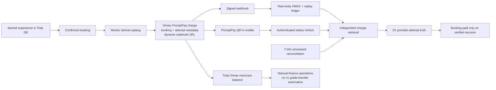

# Tirak Payment Redesign & Contract Refreeze Decision Packet

Status: **READY FOR OWNER DECISION — NO AUTHORITY EXPANSION**
Prepared: 2026-08-01
Scope: Omise PromptPay test/staging architecture, environment contract, settlement boundary, and App Review evidence
Affected frozen contracts: T-009, T-010, T-013
Governing record: `docs/execution/phase-2/payment-park-and-resequencing-record.md`

> **This packet decides; it does not execute.** It creates no Omise object, charge,
> webhook, secret, recipient, transfer, product, Cloudflare resource, D1 migration,
> EAS build, or App Store submission. It does not enable payments. Parked tasks remain
> parked until the human release owner signs a redesign choice and the affected
> contracts are re-frozen by amendment.

## 1. Decision requested

Approve or reject the following five-part payment design:

1. **PromptPay-only v1** — Tirak creates one server-side Omise PromptPay charge for
   one authenticated, confirmed, THB booking. No cards, subscriptions, tips, gifts,
   saved payment methods, or digital unlocks.
2. **Dynamic charge webhooks** — every charge is created with exactly one
   environment-pinned HTTPS `webhook_endpoints` URL. Tirak does not depend on, or
   mutate, the account's single static `webhook_uri`.
3. **Provider truth with recovery** — a valid signature is necessary but never
   sufficient to mark paid. Tirak independently retrieves the charge. T-041 performs
   scheduled reconciliation for delivery gaps because Omise does not guarantee
   webhook retries.
4. **Tirak-owned catalog and v1 settlement boundary** — experiences, prices,
   bookings, and restitution cases remain Tirak data. Charge proceeds enter Tirak's
   Omise merchant balance. Recipient creation, guide transfers, split settlement,
   and transfer schedules are deferred to a separately designed and authorized wave.
5. **Real-world-service App Store posture** — PromptPay pays for a named guided
   experience physically consumed outside the app. No payment buys content or app
   functionality. Review evidence centers the itinerary, verified provider truth,
   and booking-scoped logistics while eliminating visible or reachable compensated-
   companionship signals.

**Recommendation: approve all five together.** They form one coherent trust boundary;
mixing static and dynamic routing, or adding payout automation before the charge ledger
is proven, would reintroduce the ambiguity that caused the payment park.

## 2. Authority boundary

Approval of this packet may authorize only:

- amendment and re-freeze of T-009, T-010, and T-013;
- local code, contract, fixture, and test work implementing the signed amendment; and
- reviewed source-control branches and pull requests for that implementation under
  the existing repository workflow.

It does **not** authorize:

- setting or changing the Omise account `webhook_uri`;
- creating, completing, failing, expiring, refunding, or otherwise mutating a charge;
- rotating or creating webhook secrets;
- creating recipients, transfers, schedules, payouts, split settlements, products,
  subscriptions, or digital entitlements;
- applying D1 migrations;
- changing `PAYMENT_MODE`, `PROMPTPAY_ENABLED`, or the payment-config KV override;
- deploying another Worker version or changing Cloudflare DNS/certificates;
- production/live Omise or Cloudflare mutation;
- EAS/TestFlight builds, App Store Connect mutation, or App Store submission; or
- lifting the payment park before every §6 condition in the governing record passes.

Those operations require their own exact, itemized authority at their commitment
boundaries.

## 3. Evidence baseline

### 3.1 Current local and deployed state

| Evidence | Result | Consequence |
| --- | --- | --- |
| Public staging health | `https://api-staging.tirak.app/health` returned 200 and identified staging | A real HTTPS webhook destination exists |
| Staging payment floor | `PAYMENT_MODE=disabled`; `PROMPTPAY_ENABLED=false` | New charge creation remains closed |
| Staging Worker secret-name inventory | `JWT_SECRET`, `OMISE_SECRET_KEY`, `OMISE_WEBHOOK_SECRET`; values never captured | Required server-only secrets are provisioned |
| Payment-config namespace | Unique `tirak-payment-config-staging` binding exists; zero keys at T-036 closure | No runtime override has opened payments |
| Staging D1 | T-036 intentionally deployed without migrations; allowlisted read-only verification on 2026-08-01 returned HTTP 200, proved zero writes, found 41 user tables, matched all nine expected payment tables/indexes against `contracts/tirak-payments-v1/target-schema.sql` after normalized-DDL comparison (9/9, zero mismatches), matched the exact four-entry migration ledger (`canonical-baseline.sql`, `008_omise_promptpay_payments.sql`, `010_booking_chat_expansion.sql`, `011_payment_restitutions.sql`), and found zero foreign-key violations | Do not infer that a migration is needed; repeat the exact read-only inspection before testing and stop for separate migration authority only if drift is found |
| Mobile runtime environment | Tracked source reads only `EXPO_PUBLIC_API_URL` | No Omise key belongs in the current app runtime |
| Local mobile `.env` name-only audit | Mode `0600`; two different `EXPO_PUBLIC_API_URL` entries, neither consistently staging; no Omise secret/webhook secret or Cloudflare-token name | T-045 must create one deterministic build-profile API URL; server/operator credentials must not be copied into the mobile environment |
| Existing public Omise key | Read-only capability call succeeded; no key value was printed or persisted | The key is useful for operator preflight, not required by the mobile QR flow |

The full-scope Cloudflare token previously accepted for bounded T-036 execution is not
a mobile runtime key. Its absence from the current mobile `.env` is correct from an
application-security perspective. If operator tooling needs it again, load it only
into the named process environment from a mode-0600, ignored operator handoff or the
system keychain. Never bundle it with Expo.

Prior feedback memory also applies: before deleting an apparently orphaned Worker
secret, run `git log -S "SECRET_NAME" --all`; consuming code may exist on an unmerged
branch.

### 3.2 Current Omise facts

The following were checked against current official documentation and the official
OpenAPI schema on 2026-08-01:

- The test account reports country `TH`; PromptPay is available only in `THB` for
  this flow, with account limits of 2,000–15,000,000 satang (฿20–฿150,000).
- PromptPay completes asynchronously. `charge.complete` is a notification; Tirak must
  retrieve the charge and confirm provider truth.
- PromptPay charges cannot be voided or refunded through Omise. Tirak's existing
  restitution state is therefore not an Omise refund claim.
- An Omise account has one static webhook endpoint. A charge may instead specify up
  to two secure `webhook_endpoints`; charge events then go to those endpoints instead
  of the static endpoint.
- Omise signs the raw body with HMAC-SHA256 using a Base64-encoded, environment-specific
  secret. Rotation can produce two comma-separated signatures. The current verifier's
  raw-body, dual-signature, constant-time, timestamp-window behavior matches this model.
- Omise does not guarantee failed webhook retries. Charge retrieval and scheduled
  reconciliation are release requirements, not optional telemetry.
- The current official schema exposes charges, sources, events, balance, recipients,
  transfers, and schedules, but no product/catalog resource.
- The current Charge API does not document `Idempotency-Key` as a charge-creation
  guarantee. Tirak's `tirak:promptpay:booking:*` value remains a local ledger and
  correlation key. An indeterminate create must be recovered, never automatically
  repeated on the assumption that Omise deduplicated it.
- The test account API version was previously read back as `2019-05-29`. Direct API
  requests can pin `Omise-Version`, but webhook/event payloads use the account's
  default version at event time. Both must be checked before enablement.

### 3.3 Current Apple facts

- [App Review Guideline 3.1.3(e)](https://developer.apple.com/app-store/review/guidelines/)
  requires non-IAP payment for physical goods or services consumed outside the app.
  A guided tour, class, or itinerary physically delivered in Thailand fits this
  primary classification.
- Guideline 3.1.3(d) independently permits non-IAP payment for a real-time service
  between two individuals. It is supporting context, not Tirak's primary framing.
- Guideline 1.1.4 remains the dominant rejection risk: the submission must not look
  like a hookup, prostitution, exploitation, or compensated-companionship service.
- [App Review information](https://developer.apple.com/help/app-store-connect/reference/app-information/platform-version-information/)
  must include reachable contact details, a non-expiring demo login when login is
  required, and notes/instructions that let Review exercise the relevant states.

Apple does not publish a requirement for an “Apple refund” disclaimer, an exact count
of recordings, or a sandbox bypass. This packet does not invent those requirements.
Optional recordings may support the submission, but the submitted build and reviewer
accounts must themselves be truthful and functional.

## 4. First-principles reconstruction

### 4.1 Hard constraints

1. The user buys one named real-world experience represented by one confirmed booking.
2. The server, not the app, derives the THB amount and calls Omise.
3. The secret key and webhook secret never enter mobile code, build variables, logs,
   evidence, or source control.
4. PromptPay is asynchronous; neither the client nor a webhook body can self-declare
   success.
5. An indeterminate create cannot be retried until the exact provider outcome is known.
6. Disabling new creation must leave webhook, status, recovery, and reconciliation
   online for in-flight attempts.
7. PromptPay cancellation is not a refund; customer restitution requires its own
   controlled ledger and off-Omise procedure.
8. Test and live credentials, webhook secrets, API versions, endpoints, databases,
   and kill-switch state cannot cross environments.
9. App payment cannot unlock digital features and cannot present the service as access
   to a person.

### 4.2 Options

| Option | Provider notification | Advantages | Failure/complexity | Verdict |
| --- | --- | --- | --- | --- |
| A — static account webhook | Mutate one account-wide `webhook_uri` | Matches the original frozen T-035 | Global account state; only one static destination; couples test work to account configuration | Reject for the redesigned flow |
| B — dynamic per charge | Exact environment URL in `webhook_endpoints` at charge creation | Environment-scoped; no separate account mutation; charge and destination share one audited request | Requires a pinned URL var and contract tests; still needs reconciliation | **Recommend** |
| C — polling only | No webhook | No inbound notification dependency | Higher latency/load; poor operator signal; unnecessary loss of signed events | Retain only as fallback, never primary |

### 4.3 Reconstructed flow

### 4.4 System leverage and second-order effects

The dominant harmful loop is:

`more settlement automation → more unverified states → more support exceptions → more
release pressure → weaker evidence → still more unverified states`.

The leverage point is the contract boundary. Keeping v1 at charge-to-merchant-balance
lets T-039–T-043 prove notification, reconciliation, cancellation, and restitution
before recipient KYC, transfer fees, payout failures, tax treatment, or guide ledgers
become additional state machines.

## 5. Refreeze amendment

This is a proposed amendment, not a completed refreeze. The human owner must sign §11,
then the canonical contract artifacts and tests must implement these clauses.

### 5.1 T-009 — payment HTTP and route-surface contract

The mobile-facing four-route contract remains `tirak-payments-v1`; no client field or
status meaning changes. Record this governance revision separately as
`tirak-payments-v1-amendment-1` rather than falsely creating a breaking public API.

Add these provider-side invariants:

1. Charge creation sends exactly one configured `webhook_endpoints` HTTPS URL for the
   active environment. It never accepts a URL from the client or request body.
2. Every provider request sends the contract-pinned `Omise-Version` header.
3. Charge metadata contains `booking_id`, `payment_attempt_id`, and `attempt_number`.
4. Create, retrieve, recover, webhook reconciliation, and scheduled reconciliation
   validate ID, amount, `THB`, `source.type=promptpay`, metadata ownership, and expected
   `livemode` before any local success transition.
5. Server-side price validation rejects amounts below 2,000 or above 15,000,000 satang
   before an Omise call. Pre-enable capability read-back must confirm the account still
   exposes compatible limits.
6. The local idempotency key is not represented as an Omise guarantee. Network-ambiguous
   creation becomes `indeterminate`; exact recovery or scheduled reconciliation must
   resolve it before another charge is allowed.
7. Unknown event types and unrelated charge events return safely without changing a
   booking. The static account webhook is not an integration dependency.

### 5.2 T-010 — payment, cancellation, and restitution state contract

Retain the existing state matrix and add these rows/interpretations:

| Condition | Provider attempt | Booking | Required action |
| --- | --- | --- | --- |
| Webhook absent/delayed | unchanged | unchanged | Authenticated status refresh and T-041 reconciliation retrieve provider truth |
| Signature invalid/stale | unchanged | unchanged | 401, redacted telemetry, no D1 payment mutation |
| Signature valid; provider retrieval fails | unchanged; event ledger `failed` | unchanged | Retry/reconciliation; never trust embedded event status |
| Provider fields or livemode mismatch | unchanged | unchanged | Quarantine/alert; no success transition |
| Provider `successful` after verified retrieval | `successful` | paid | Idempotent one-way transition |
| Provider `failed`/`expired` after verified retrieval | matching terminal state | failed unless already paid | Explicit retry may create the next attempt |
| Paid booking cancellation request | `successful` remains true | cancellation blocked | Open one controlled restitution case; never label Omise-refunded |

Disabling creation changes no in-flight state. Local wall-clock expiry may change copy
or trigger a retrieval, but only provider truth may terminally expire an attempt.

### 5.3 T-013 — environment, identity, and rollout contract

Add `OMISE_API_VERSION` and `OMISE_WEBHOOK_URL` as non-secret Worker variables. Update
the stale environment matrix with the real staging API URL and `PAYMENT_CONFIG_KV`.
Assert account-default webhook serialization version and per-request version before
enablement.

| Environment | `OMISE_API_VERSION` | `OMISE_WEBHOOK_URL` | Mode floor | Secret mode |
| --- | --- | --- | --- | --- |
| local disposable | `2019-05-29` | local HTTPS test receiver or provider-mocked URL; never localhost in a real Omise call | test only in disposable harness | test |
| staging | `2019-05-29` | `https://api-staging.tirak.app/api/payments/webhooks/omise` | `disabled` / `false` | test |
| production | `2019-05-29` | exact production HTTPS endpoint, unresolved until production-domain confirmation | `disabled` / `false` | live |

The deployed static floor remains disabled. Only the audited KV override may open new
creation. A malformed/unreadable override closes creation. Webhook, status, recovery,
and T-041 reconciliation remain available whenever their server secrets and schema
exist, even while creation is closed.

## 6. Exact environment and binding matrix

No values belong in this packet. “Operator-only” means available only to a controlled
CLI or read-only preflight process, never shipped in the app.

| Name | Class/location | Required for | Secret? | Contract rule |
| --- | --- | --- | --- | --- |
| `EXPO_PUBLIC_API_URL` | Expo build variable | Mobile → Worker routing | No | Exactly one per profile; staging must use `https://api-staging.tirak.app`; strip a trailing `/api` only by the existing client rule |
| `OMISE_SECRET_KEY` | Worker secret | Charge create/retrieve/recover/reconcile | **Yes** | `skey_test_*` outside production; `skey_live_*` only in production/live mode; never local mobile env |
| `OMISE_WEBHOOK_SECRET` | Worker secret | Raw-body HMAC verification | **Yes** | Separate test/live secrets; Base64 decoded; rotation order must preserve at least one accepted signature |
| `JWT_SECRET` | Worker secret | Authenticated customer/payment routes | **Yes** | Unique per environment; never a committed Wrangler var outside disposable development |
| `ENVIRONMENT` | Worker var | Environment crossover guard | No | One of development/test/staging/production; production is exact |
| `PAYMENT_MODE` | Worker var + audited KV override | disabled/test/live policy | No | Deployed staging/production floor remains `disabled` |
| `PROMPTPAY_ENABLED` | Worker var + audited KV override | New-charge feature gate | No | Deployed staging/production floor remains `false`; disabling never stops settlement paths |
| `OMISE_API_VERSION` | **Proposed Worker var** + operator preflight copy | Request serializer pin and account/request comparison | No | Exact reviewed version `2019-05-29`; account default also read back before enablement |
| `OMISE_WEBHOOK_URL` | **Proposed Worker var** | Dynamic charge notification route | No | Exact HTTPS allowlist; never client-supplied; staging value pinned above |
| `FRONTEND_URLS` | Worker var | CORS boundary | No | Environment-specific allowlist; not a payment credential |
| `DB` | D1 binding | Bookings, attempts, webhook events, restitutions | No | Correct environment ID; payment schema must pass exact pre-enable inspection |
| `PAYMENT_CONFIG_KV` | KV binding | Audited mode override and immutable toggle audit | No | Unique per environment; not a webhook replay store |
| `CACHE` | KV binding | Rate limits/cache | No | Failure policy independently audited; not payment truth |
| `SESSIONS` | KV binding | Session/auth support | No | Correct environment ID; not payment truth |
| `OMISE_PUBLIC_KEY` | Operator preflight only in current architecture | `GET /capability` and limit/payment-method proof | No | `pkey_test_*` for staging preflight; current mobile flow does not need or read it |
| `TIRAK_CLOUDFLARE_API_TOKEN` | Staging discovery/provisioner process | Strict staging resource discovery | **Yes** | Mode-0600 ignored handoff/keychain; never a flag, Worker secret, or Expo variable |
| `TIRAK_CLOUDFLARE_ACCOUNT_ID` | Staging discovery process | Account target | No | Must equal the pinned Tirak account; discovery also has a pinned default |
| `CLOUDFLARE_API_TOKEN` | Payment-toggle operator process | Audited KV override | **Yes** | Process environment only; exact human authority required for every write |
| `CLOUDFLARE_ACCOUNT_ID` | Payment-toggle operator process | Account target | No | Must equal pinned account `2c0c96c68f0ee73b6d980054557bca5b` |
| `CF_API_TOKEN` / `CF_ACCOUNT_ID` | Human handoff aliases only | Source values for operator setup | Token: **Yes**; ID: No | Repo scripts do not consume these aliases directly; map them at the process boundary to the exact `TIRAK_CLOUDFLARE_*` or `CLOUDFLARE_*` names without copying the token into Expo or source control |
| `TIRAK_STAGING_READ_ONLY_AUTHORIZATION` | Operator sentinel | Read-only discovery gate | No | Exact approved sentinel only; it is not mutation authority |

### Keys that are not needed

- `EXPO_PUBLIC_OMISE_SECRET_KEY` and `EXPO_PUBLIC_OMISE_WEBHOOK_SECRET` must never exist.
- `EXPO_PUBLIC_OMISE_PUBLIC_KEY` is unnecessary for the current server-created QR flow.
- Mobile `PAYMENT_MODE` or `PROMPTPAY_ENABLED` values are not security controls and
  should not be treated as authoritative.
- There is no Omise product, catalog, settlement, recipient, or payout-specific API
  key. The secret key authorizes those account APIs; scope is enforced by code,
  operator procedure, and explicit human authority—not by inventing extra env keys.
- PostHog/Sentry variables are operational tooling, not payment prerequisites.

## 7. Product, settlement, and restitution boundaries

| Concern | System of record | V1 behavior | Later scope, if separately approved |
| --- | --- | --- | --- |
| Experience/product | Tirak D1/application domain | Named itinerary with server-owned price | No Omise product object exists |
| Purchase | Tirak booking + Omise charge | One confirmed booking → one active attempt | Additional payment rails require new contracts |
| Payment truth | Omise charge, projected into D1 | Provider retrieval controls paid state | Never infer from QR display or client callback |
| Merchant settlement | Omise balance + finance records | Net proceeds accumulate in Tirak merchant account; manual finance operation | Automated withdrawal may be evaluated separately |
| Guide compensation | Tirak operations/legal ledger | Out of payment v1; no Omise recipient/transfer calls | Recipient verification, transfer idempotency, fees, tax/KYC, failure/reversal state machine |
| Customer restitution | Tirak restitution ledger + off-Omise evidence | Manual controlled case; PromptPay remains provider-paid | Alternative refundable rail only under a new design |

The owner must confirm the business/legal arrangement for customer contracting,
guide compensation, tax, and consumer restitution before live launch. This engineering
packet does not declare a legal merchant-of-record status.

## 8. Re-scoping parked tasks

If the recommendation is signed:

- **T-035** — supersede the account-static registration objective. Do not PATCH
  `account.webhook_uri`. Move signed-delivery acceptance into the first authorized
  dynamic test charge: charge request records the exact staging URL, Omise sends a
  valid signed event, D1 records one replay row, and independent retrieval controls
  the booking transition.
- **T-037/T-038** — retain happy-path and negative test-mode work, but require dynamic
  destination evidence, API-version/livemode checks, provider-limit enforcement, and
  a post-test return to disabled creation.
- **T-039/T-040** — add destination/version/livemode mismatch, webhook-delivery lag,
  and reconciliation-gap signals; never log endpoint query data or secrets.
- **T-041** — remain the authoritative missed-webhook/aged-attempt fallback. It may
  retrieve/list provider data but cannot create a charge.
- **T-042/T-043** — retain indeterminate recovery, cancellation interlock, and manual
  restitution; explicitly prohibit Omise refund claims for PromptPay.
- **T-044** — cannot close until schema, charge, signed webhook, retrieval,
  reconciliation, restitution tabletop, telemetry, and disable-after-test evidence
  all pass.

No parked branch opens merely because this packet exists. The signed amendment must
first be incorporated into the canonical contract artifacts and re-approved.

## 9. Staging execution sequence after separate authority

This sequence is informative; every mutation boundary still needs exact authority.

1. Merge the signed contract amendment and local tests with zero provider calls.
2. Run an exact read-only D1 schema/index/FK/ledger inspection. If it passes, apply no
   migration. If it shows drift, stop; only a separate recovery-point-backed migration
   decision and authority may change staging D1.
3. Deploy the amended Worker with static flags still disabled; prove production
   unchanged and the dynamic endpoint/version vars exact.
4. Read back secret names, test account identity, `livemode=false`, API version,
   PromptPay capability, and current limits without capturing credential values.
5. Use the audited KV operator path to open `PAYMENT_MODE=test` and
   `PROMPTPAY_ENABLED=true` only after every pre-enable assertion passes.
6. Create exactly the separately authorized number of confirmed-booking charges.
   Prove the provider request used the exact dynamic endpoint and metadata.
7. In Omise Test Mode, mark the authorized charge successful/failed as prescribed.
   Prove a real Omise-signed delivery, one replay row, independent retrieval, and the
   exact D1/booking transition.
8. Exercise authenticated refresh and T-041 reconciliation so success does not depend
   on webhook delivery alone.
9. Return new creation to disabled immediately; prove in-flight settlement routes
   remain live and production is unchanged.
10. Only after the staging operations gate closes may mobile device/EAS and App Review
    gates proceed.

### Pre-registered abort triggers

Halt without retry or improvisation if any of these is observed:

- Omise account ID, country, currency, `livemode`, API version, PromptPay capability,
  or limits differ from the signed target;
- the expected dynamic endpoint is absent, non-HTTPS, client-controlled, or points to
  the wrong environment;
- any required Worker secret name or D1 payment object is absent;
- payment creation is already enabled before the signed toggle;
- a provider response fails ID/amount/currency/source/metadata/livemode checks;
- a valid event cannot be signature-verified from exact raw bytes;
- paid state would be written without an independent provider retrieval;
- the replay/event ledger cannot prove exactly-once processing semantics;
- any production Worker, secret, KV, D1, DNS, domain, or Omise live state changes; or
- the post-test disable proof fails.

## 10. App Review gate

### Commerce classification

Use Guideline 3.1.3(e) as the primary statement: the charge pays for a named guided
experience physically delivered outside the app. PromptPay is therefore an external
payment method for a real-world service, not an IAP substitute.

### Required product evidence before build

- All reachable browsing starts with an itinerary/experience, not access to a person.
- Payment is shown only for an authenticated, confirmed booking; amount comes from the
  backend booking record.
- Chat is tied to one active booking and limited by product policy to trip logistics.
- No reachable UI offers dates, companionship, open-ended hangouts, tips, gifts,
  custom pay-to-person amounts, or digital unlocks.
- Internal compatibility names are not themselves an Apple rule violation, but no
  compatibility path may make the old behavior visible or reachable. Run source,
  fixture, translation, navigation, notification, mock, and post-build string audits
  as defense-in-depth.
- Payment wording names the itinerary, THB total, PromptPay processor, asynchronous
  verification, and Tirak support/restitution path. Do not invent an Apple-required
  refund disclaimer.

### Reviewer fixture and notes before submission

- Provide a non-expiring reviewer login and exact navigation instructions.
- Provide at least one confirmed unpaid booking so Review can inspect the real checkout
  boundary, plus one provider-verified paid booking showing the terminal state.
- A paid fixture must originate from a real verified provider charge under the signed
  fixture contract; never use a hidden paid-state bypass.
- Explain that Tirak sells pre-defined guided cultural experiences in Thailand, not
  dating, escort, or companionship.
- Explain that external payment is for the real-world experience under 3.1.3(e), with
  no IAP, subscription, tip, gift, or digital entitlement.
- Explain when booking chat appears and that it is itinerary logistics only.
- Include reachable contact name, email, and phone; privacy/support URLs; any test
  constraints; and optional concise screen/video evidence if it materially helps.
- Verify the exact submitted build, accounts, backend target, metadata, screenshots,
  and notes immediately before submission.

No EAS build or App Store Connect action is authorized by this section.

## 11. Owner signature block

### Recommended approval statement

To approve the recommendation and authorize contract refreeze/local implementation
only, the human release owner may send this exact statement:

> I approve the Tirak Payment Redesign Decision dated 2026-08-01: PromptPay-only v1;
> Tirak-owned experiences and booking prices; exactly one environment-pinned dynamic
> Omise webhook endpoint per charge instead of account-static webhook registration;
> provider retrieval plus T-041 reconciliation as payment truth; proceeds limited to
> Tirak's Omise merchant balance with no guide-recipient or transfer automation; and
> the real-world-service App Review posture under Guideline 3.1.3(e). I authorize the
> T-009, T-010, and T-013 amendment/refreeze and local implementation/validation work.
> I also authorize reviewed source-control branches and pull requests for that work.
> This does not authorize Omise or Cloudflare mutation, charges, webhook-secret
> rotation, D1 migrations, payment enablement, recipients, transfers, payouts,
> subscriptions, digital unlocks, production/live activity, EAS builds, TestFlight,
> App Store Connect mutation, or App Store submission.

### Decision record

- ☐ **APPROVE RECOMMENDATION** — apply the five-part design and refreeze amendment.
- ☐ **NO-GO** — retain the payment park; record the rejected clause and desired
  alternative before any contract or implementation work.

| Field | Entry |
| --- | --- |
| Human release owner | ____________________ |
| ISO date | ____________________ |
| Decision | ____________________ |
| Exact confirmation | ____________________ |

## 12. Primary sources

### Omise

- [PromptPay](https://docs.omise.co/promptpay)
- [Charge API](https://docs.omise.co/charges-api)
- [Webhooks, dynamic destinations, signatures, rotation, and retry caveat](https://docs.omise.co/api-webhooks)
- [Testing and test-mode completion](https://docs.omise.co/api-testing)
- [Capability API](https://docs.omise.co/capability-api/thailand)
- [Official API schema](https://api.omise.co/schema)
- [API versioning](https://docs.omise.co/en/api-versioning/thailand)
- [Balance API](https://docs.omise.co/balance-api)
- [Recipient API](https://docs.omise.co/recipients-api)
- [Transfer API](https://docs.omise.co/transfers-api)

### Apple

- [App Review Guidelines](https://developer.apple.com/app-store/review/guidelines/)
- [App Review information fields](https://developer.apple.com/help/app-store-connect/reference/app-information/platform-version-information/)
- [Overview of submitting for review](https://developer.apple.com/help/app-store-connect/manage-submissions-to-app-review/overview-of-submitting-for-review/)

## 13. Independent review record

Three bounded, one-turn, no-tool reviews ran through native non-Codex OmniRoute profiles.
They were advisory only; every accepted claim was checked against local code or a
primary source, and unsupported recommendations were rejected.

| Review | Profile/model | Terminal result | Cost | Disposition |
| --- | --- | --- | --- | --- |
| Omise architecture | `no-think-gh-claude-sonnet-5` / `no-think/gh/claude-sonnet-5` | success, session `fdfa06a4-d3d1-4935-b19c-c00cbb48f180` | $0.09417 | Accepted dynamic-webhook/reconciliation boundary; corrected KV/replay and kill-switch overstatements |
| Apple commerce | `no-think-antigravity-claude-sonnet-5` / `no-think/antigravity/claude-sonnet-5` | success, session `1dc2aaa4-9b6a-4352-ad7a-e53997eca338` | $0.055476 | Accepted 3.1.3(e)/1.1.4 framing; rejected invented disclaimer, recording count, sandbox bypass, and do-not-test advice |
| Final packet governance | `no-think-gh-claude-sonnet-5` / `no-think/gh/claude-sonnet-5` | success, session `d6e19d8d-e764-4516-9c79-0a43c05329ed` | $0.129396 | **APPROVE**; no material blockers; merged the duplicate API-version matrix row suggested as a nonblocking clarity improvement |
